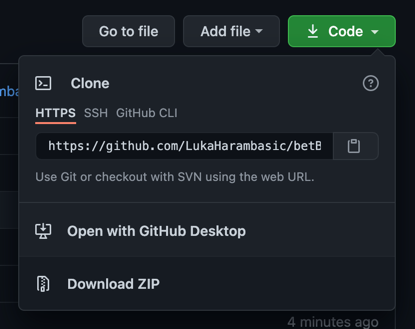

# betBot for [kicktipp.de](https://www.kicktipp.de/)

> Happy for PRs and if you find a nice way to deploy this for non technical users.

## Why?

I'm a handball fan, but I like to bet with my friends. I also know myself, and I know that I would forget to bet one day and then my chances to win are near zero. And if that I have at least a bet on each match during the group phase.

## Open topics / ideas

- [ ] Future proof for final rounds - currently only the group phase is working
- [ ] Dockerfile
- [ ] Publish to dockerhub
- [ ] Find one click deploy solution
- [ ] Add tests
- [ ] Check for typos
- [ ] Restructure the project

## How to use

1. Check that you have the right Node.js version - [install Node.js](https://nodejs.org/en/download/).
```bash
node -v # you 14 or newer
```
2. Download or clone this repository.

   
3. Rename `sample.env` to `.env`.
4. Add your [kicktipp.de](https://www.kicktipp.de/) credentials:
    - TEAM - you find it in the URL `https://www.kicktipp.de/handball/tippabgabe` -> **handball**
    - EMAIL
    - PASSWORD
5. Run `npm install` in your terminal - run this after each update.
6. Run `npm run start` in your terminal - every time you want to set your goals.
7. Enjoy the show and win the game! :)

PS: This bot doesn't do the bonus bets! Don't forget them!!
